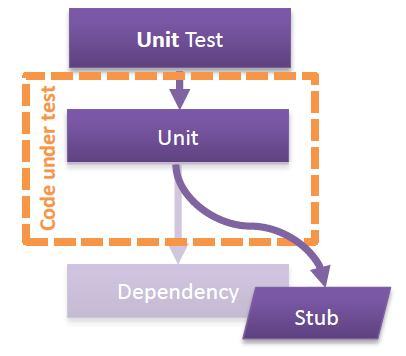
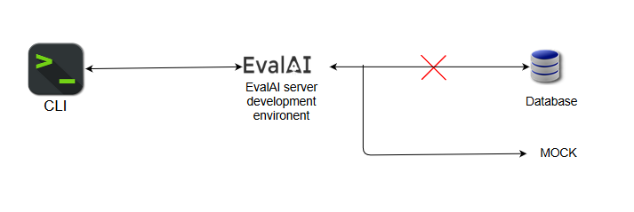

<h4> Report on testing CLI with EvalAI server on Production/Staging branch on CI/CD pipeline </h4>

Testing is a crucial part of the CI/CD process. Unit tests cover individual units in the code by using a stubbing
approach i.e. pre-defined responses that will be used for a specific request. However, this does not give a complete
picture of how all the components interact.

Currently on the CI/CD pipeline for the EvalAI-CLI project, only unit tests are run. In the actual application, we use
the CLI in integration with the EvalAI server. To test this complete setup, integration tests are required.

The following is a SPIKE report on implementing integration tests to check the interaction of CLI with the server.

<h5> Environment  Setup </h5>
In addition to the basic setup for the CLI, the server environment needs to be set up.

For the environment setup, the alternatives are:

<h6> Run EvalAI server in development environment in Travis VM </h6>

The server should be set up on Travis-CI VM so as to:
  1.	Ensure that the tests run fast.
  2.	Avoid any errors/build failures caused due to issues in the evalapi server.
  3.	Avoid blocking of CI process when for example, the evalapi server is down.

For this setup to work, the EvalAI server needs to be set up as follows:
  1.	Creating token setup for users required for the test (e.g. participant1, participant2, host1, host2, etc.)
  2.	Setting up the database that the server will be modifying: as our objective is only to test the interaction
  between the CLI and the server, this part can be mocked.

  

However, setting up the environment this way can take a lot of time. On the Travis VM, setting up the server took about
8-10 minutes on average. This makes the method unsuitable for regular testing on CI/CD pipeline. But, this can be
implemented successfully on the Production/Staging branches where updates are less frequent. For example, the build can
be triggered whenever there is a change in the Production/Staging branches of either EvalAI or evalai-cli.

P.S.: When I tried to set up the environment locally and on Travis, Celery threw some errors which made it to
stop working. Still looking into this issue. See: https://travis-ci.com/nikochiko/evalai-cli/jobs/267038723

<h6> Testing with evalapi server </h6>

This is the more hassle-free approach. Direct tests can be written against the evalapi server. Users can be created for
testing purposes and few challenges (preferably those used for tutorial purposes) can be used for realistic testing.

This approach is better when
[running Travis-CI locally](https://medium.com/google-developers/how-to-run-travisci-locally-on-docker-822fc6b2db2e).
While running it publicly, the auth token will be exposed. A better way can be to add functionality within the EvalAI
server to allow for such testing with mock databases as mentioned above.

For a very rough example of the code, I used auth token from a user I created for this task.

See [code comparison](https://github.com/Cloud-CV/evalai-cli/pull/208) on GitHub.

<h5> The Tests: </h5>
For the tests, it is convenient to take a testing approach as creating tests for each command one-at-a-time and covering
all its corner cases.

For example, the test cases for `challenges` and `challenge` commands can have a
checklist with these cases:

* `evalai challenges`

	Invokes: `evalai.challenges.challenges`

  Cases:

    * With few challenges
  	* With no challenges
    * Exception when host URL is unreachable
    * Exception when user is not authenticated

* `evalai challenges ongoing`

  Invokes: `evalai.challenges.ongoing`

  Cases:

    * With few ongoing challenges
    * With no ongoing challenges
    * Exception when host URL is unreachable
    * Exception when user is not authenticated

  Similarly for:

    * `evalai.challenges.future`
    * `evalai.challenges.past`

* `evalai challenge <challenge_id>`

	Invokes: `evalai.challenges.challenge`

	Cases:

    * When challenge  exists
    * When challenge does not exist
    * When host URL is unreachable
    * When user is not authenticated

* `evalai challenges --participant`

	Invokes: `evalai.challenges.challenges` with `participant=True`

	Cases:

    * When user has participated in few challenges
    * When user has not participated in any challenges

  Similarly for `evalai challenges --host`

<h5> The Conclusion: </h5>

* Testing CLI with EvalAI server will require much setup, and possibly changes in the EvalAI server to enable testing.
* Among the setup approaches, the second one (testing against evalapi) is better in the short term if the credentials
 don't become an issue. With this approach, there would be almost no extra work required. An example challenge can be
 created as a tutorial for new users and can be used for testing as well.
* However in the long term, the first approach (testing against a development environment)should be preferred as it
 allows for more complete testing with more control over the server. With this approach, the work on the setup would
 take around 2-3 weeks.
* The tests will also be easier to write while testing against the live evalapi server while writing in the other
  scenario would also include adding mock challenges, submissions, participant teams, etc. A rough estimate would be
  around 8 weeks for writing complete tests in the first case and 10-12 weeks for the second case.
* Overall:  

Taking the approach to write tests against the live evalapi server can take just over 8 weeks.

A summary of this approach is as follows:
*	Lightweight, faster to implement
*	Testing time will not be much (currently it is around 40 seconds, adding these tests, it would be around 1 minute on
  Travis).
*	Can be implemented more frequently on the CI/CD as it is light-weight
*	However, the approach is crude and more prone to errors
*	Development on CLI project can come to a halt when the server is down
*	Less freedom while writing tests as the data needs to be present on the live server
*	Exposing the credentials of the test user could become a potential issue
*	Currently, the API does not have functionality to create challenges/phases or load additional data on the database,
 except for making submissions. But later, writing tests for such conditions can be problematic as the database being
 used for tests is the same as that being used for production.
*	As a walkaround, functionality can be added inside EvalAI server to allow developer testing with temporary mock
 databases.

Taking the approach to write tests for a developer environment setup on the Travis VM can take around 12-16 weeks for a
complete setup.

The summary for this:
*	More complex, heavyweight
*	Testing time will be greatly increased. Setting up the server takes around 8-10 minutes.
*	Should only be used for final checks for Production/Staging branches on the CI/CD pipeline due to being slow.
*	Mocking the database adds additional complexity. (As a workaround, a separate branch can be maintained on the main
  EvalAI project -- such as `production-mockdb` -- where we allow for this functionality. Then while setting up the
  server, that branch can be cloned with `git clone --branch production-mockdb` and then running `docker-compose` up for
  that)
*	Allows for more freedom on the type of tests to be written. More customizable
*	Will not be a problem even if more functionality is added in the CLI
*	More suitable for long-term
